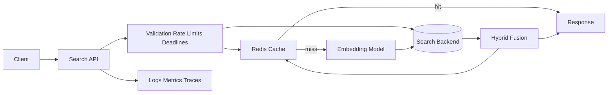
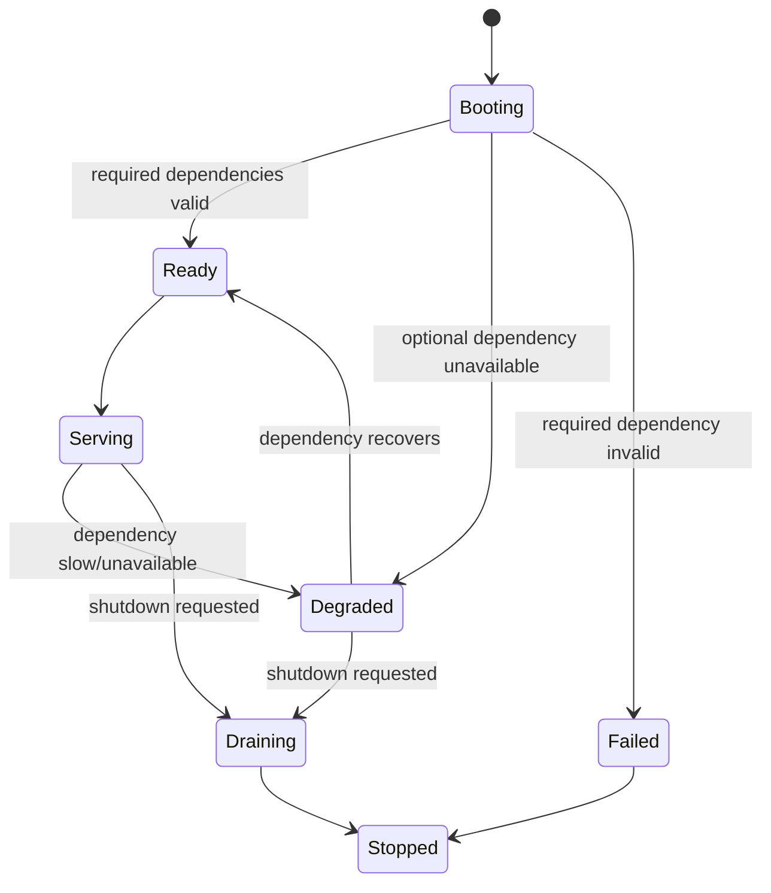
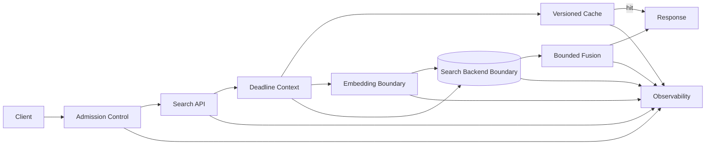

# Hybrid Search v1

## Problem

Build one product API endpoint that performs hybrid search over 1 million magazine records.

The endpoint shall combine keyword search, vector search, and hybrid ranking over two logical tables:

- `MagazineInfo`: `id`, `title`, `author`, `publication_date`, `category`, metadata.
- `MagazineContent`: `id`, `magazine_id`, `content`, `vector_representation`, content metadata.

v1 refactors the original take-home into a production-aware contract. v1 does not chase scale blindly. v1 bounds operational and economic risk first.

Operational endpoints are allowed. They do not count against the "one product endpoint" requirement.

## v1 Envelope

These are initial v1 bounds. If implementation cannot meet them, the bound must be revised in this file before the implementation can claim acceptance.

| Dimension | v1 Bound |
| --- | --- |
| Product endpoint count | 1 |
| Operational endpoints | allowed for health and metrics |
| Target corpus | 1,000,000 magazine records |
| CI/smoke corpus | 10,000 records |
| Minimum corpus for v1 performance claim | 1,000,000 records |
| Max query length | 256 characters |
| Max request body | 4 KiB |
| Max `top_k` | 20 |
| Max pagination offset | 1,000 |
| Max keyword candidates before fusion | 100 |
| Max vector candidates before fusion | 100 |
| Max fusion candidates | 200 |
| Request deadline | 2,000 ms |
| Elasticsearch/search timeout | 1,200 ms |
| Redis timeout | 100 ms |
| Embedding timeout | 500 ms |
| Cold-query p95 target | <= 1,500 ms |
| Cold-query p99 target | <= 2,000 ms |
| Cached-query p95 target | <= 100 ms |
| Cached-query p99 target | <= 250 ms |
| Global concurrent product requests | 16 |
| Per-client request rate | 60/minute |
| Global product request rate | 120/minute |
| API memory budget | 2 GiB |
| Redis memory budget | 512 MiB |
| Search backend memory budget | 6 GiB |
| Local disk budget | 30 GiB |
| v1 monthly paid cloud budget | 0 GBP |
| v1 monthly local/dev budget | <= 20 GBP incremental cost |
| 5xx error budget under target load | <= 1% |

## FR

- [ ] FR-001: Provide one search endpoint.
  - [ ] Accept query string.
  - [ ] Accept bounded result limit.
  - [ ] Accept bounded pagination.
  - [ ] Accept optional category filter.
  - [ ] Return deterministic response shape.
  - [ ] Return deterministic error shape.
  - [ ] Expose no other product endpoint.

- [ ] FR-002: Support keyword search.
  - [ ] Search `title`.
  - [ ] Search `author`.
  - [ ] Search `content`.
  - [ ] Support analyzer-backed normalization.
  - [ ] Support field weighting.

- [ ] FR-003: Support vector search.
  - [ ] Generate query embedding.
  - [ ] Search stored content vectors.
  - [ ] Return semantically similar candidates.
  - [ ] Bound vector retrieval cost.

- [ ] FR-004: Support hybrid search.
  - [ ] Retrieve keyword candidates.
  - [ ] Retrieve vector candidates.
  - [ ] Deduplicate candidates.
  - [ ] Fuse scores.
  - [ ] Return one ranked result list.
  - [ ] Return score metadata for debugging.
  - [ ] Mark degraded results explicitly.

- [ ] FR-005: Support required data model.
  - [ ] Store magazine information.
  - [ ] Store magazine content.
  - [ ] Link content to magazine information.
  - [ ] Store vector representation.
  - [ ] Record schema version.
  - [ ] Record embedding model version.

- [ ] FR-006: Provide usable documentation.
  - [ ] Document setup.
  - [ ] Document data generation or import.
  - [ ] Document schema/index creation.
  - [ ] Document API usage.
  - [ ] Document example requests.
  - [ ] Document example responses.
  - [ ] Document performance envelope.

### Tests Per FR

- [ ] FR-001 tests
  - [ ] Valid request returns bounded results.
  - [ ] Missing query is rejected.
  - [ ] Empty query is rejected.
  - [ ] Oversized query is rejected.
  - [ ] Invalid limit is rejected.
  - [ ] Invalid pagination is rejected.
  - [ ] Category filter changes candidate set.
  - [ ] No second product endpoint exists.

- [ ] FR-002 tests
  - [ ] Title match is returned.
  - [ ] Author match is returned.
  - [ ] Content match is returned.
  - [ ] Field weighting affects ranking.
  - [ ] Analyzer behavior is verified.
  - [ ] BM25-only baseline is reproducible.

- [ ] FR-003 tests
  - [ ] Query embedding has expected dimension.
  - [ ] Vector search returns semantic neighbors.
  - [ ] Missing vector is handled.
  - [ ] Wrong vector dimension is rejected or quarantined.
  - [ ] Vector-only baseline is reproducible.

- [ ] FR-004 tests
  - [ ] Duplicate candidates are merged.
  - [ ] Ranking is deterministic for fixed inputs.
  - [ ] Score metadata is present.
  - [ ] Hybrid result quality is compared against baselines.
  - [ ] Degraded responses include degradation metadata.

- [ ] FR-005 tests
  - [ ] `MagazineInfo` schema is valid.
  - [ ] `MagazineContent` schema is valid.
  - [ ] Magazine/content relationship is valid.
  - [ ] Required fields are enforced.
  - [ ] Schema version is recorded.
  - [ ] Model version is recorded.

- [ ] FR-006 tests
  - [ ] Setup instructions run from clean checkout.
  - [ ] Example request works.
  - [ ] Example response matches documented schema.
  - [ ] Performance report is reproducible.

## NFR

### Invariants

- [ ] Every accepted request has a request ID.
- [ ] Every accepted request has a deadline.
- [ ] Every external dependency call has a timeout.
- [ ] Every user-controlled input has a bound.
- [ ] Every emitted metric uses bounded-cardinality labels.
- [ ] Every response is produced from one active index version.
- [ ] Every vector query uses the active embedding model version.
- [ ] Every cache entry is tied to query parameters, schema version, index version, and model version.
- [ ] Cache is never required for correctness.
- [ ] Redis failure cannot corrupt search results.
- [ ] Raw query text is not logged by default.
- [ ] Invalid index state blocks readiness.
- [ ] Missing required document fields are handled explicitly.
- [ ] Missing or invalid vectors are handled explicitly.
- [ ] No version may claim a property it does not measure.

### Guarantees

- [ ] Bounded requests fail fast.
- [ ] Dependency failure returns bounded errors.
- [ ] Overload returns bounded errors.
- [ ] Degraded responses are never silent.
- [ ] Cache hits and misses are observable.
- [ ] Cold-query and cached-query latency are measured separately.
- [ ] Keyword-only, vector-only, and hybrid behavior are separately measurable.
- [ ] Reindexing does not silently mix incompatible cache/index/model state.
- [ ] Startup does not report ready until required dependencies and schema are valid.
- [ ] Shutdown stops accepting new work before closing dependencies.
- [ ] Setup is reproducible from a clean checkout.
- [ ] v1 does not require paid cloud infrastructure.

### Constraints

#### Economic

- [ ] v1 shall declare a monthly development/runtime cost target.
- [ ] v1 shall estimate storage cost for 1 million records.
- [ ] v1 shall estimate cold-query compute cost.
- [ ] v1 shall estimate cached-query cost.
- [ ] v1 shall estimate cache memory cost.
- [ ] v1 shall avoid v2 cloud infrastructure spend.
- [ ] v1 shall not improve relevance by unbounded compute.
- [ ] v1 shall stay within the v1 envelope unless this document is updated first.

#### Operational

- [ ] v1 shall use `uv`.
- [ ] v1 shall use `pyproject.toml`.
- [ ] v1 shall use `uv.lock`.
- [ ] v1 shall use `.env` for runtime configuration.
- [ ] v1 shall pin maintained modern library versions.
- [ ] v1 shall define supported Python version.
- [ ] v1 shall run from clean checkout.
- [ ] v1 shall expose liveness.
- [ ] v1 shall expose readiness.
- [ ] v1 shall define startup checks.
- [ ] v1 shall define shutdown behavior.
- [ ] v1 shall include runbook commands.

#### Out Of Scope For v1

- [ ] No GCP deployment.
- [ ] No Terraform.
- [ ] No Kubernetes.
- [ ] No managed cloud search service.
- [ ] No Jaeger.
- [ ] No multi-region deployment.
- [ ] No production CI/CD pipeline.
- [ ] No service mesh.
- [ ] No zero-trust architecture.
- [ ] No SLA commitment.
- [ ] No GDPR compliance claim.
- [ ] No microservice split unless a single process violates the v1 envelope.

### Qualities To Optimise For

- [ ] Bounded cost.
- [ ] Bounded latency.
- [ ] Bounded memory.
- [ ] Bounded dependency load.
- [ ] Predictable degradation.
- [ ] Observable failure.
- [ ] Reproducible setup.
- [ ] Deterministic dependencies.
- [ ] Measurable relevance.
- [ ] Simple operation.
- [ ] Explicit v2 separation.

#### Tests Per NFR

- [ ] Cost tests
  - [ ] Estimate cost per 1,000 cold searches.
  - [ ] Estimate cost per 1,000 cached searches.
  - [ ] Estimate storage cost for 1 million records.
  - [ ] Fail if v1 exceeds 30 GiB local disk budget without updating the envelope.

- [ ] Latency tests
  - [ ] Measure cold-query p50, p95, p99.
  - [ ] Measure cached-query p50, p95, p99.
  - [ ] Measure embedding latency.
  - [ ] Measure search backend latency.
  - [ ] Fail if p95/p99 targets exceed the envelope without updating the envelope.

- [ ] Memory tests
  - [ ] Measure API memory at idle.
  - [ ] Measure API memory under load.
  - [ ] Measure Redis memory growth.
  - [ ] Measure search backend memory pressure.
  - [ ] Fail if memory budgets exceed the envelope without updating the envelope.

- [ ] Degradation tests
  - [ ] Redis unavailable.
  - [ ] Search backend unavailable.
  - [ ] Search backend slow.
  - [ ] Embedding generation slow.
  - [ ] Cache miss storm.

- [ ] Observability tests
  - [ ] Logs contain request ID.
  - [ ] Logs contain error category.
  - [ ] Metrics expose latency.
  - [ ] Metrics expose cache hit ratio.
- [ ] Metrics expose dependency failures.
- [ ] Metrics do not expose raw query strings as labels.
  - [ ] OpenTelemetry trace context is emitted when tracing is enabled.

- [ ] Relevance tests
  - [ ] Golden query set exists.
  - [ ] BM25-only baseline exists.
  - [ ] Vector-only baseline exists.
  - [ ] Hybrid ranking is measured.
  - [ ] Hybrid must not regress below BM25-only on the golden query set.
  - [ ] Hybrid must not regress below vector-only on semantic-intent queries.

### Scale

#### Quantified

- [ ] Corpus target: 1,000,000 magazine records.
- [ ] CI/smoke corpus: 10,000 records.
- [ ] Minimum corpus for v1 performance claim: 1,000,000 records.
- [ ] Max query length: 256 characters.
- [ ] Max request body size: 4 KiB.
- [ ] Max `top_k`: 20.
- [ ] Max pagination offset: 1,000.
- [ ] Max concurrent product requests: 16.
- [ ] Cold-query p95 target: <= 1,500 ms.
- [ ] Cold-query p99 target: <= 2,000 ms.
- [ ] Cached-query p95 target: <= 100 ms.
- [ ] Cached-query p99 target: <= 250 ms.
- [ ] 5xx error budget under target load: <= 1%.

## Core Entities

- [ ] `Magazine`
  - [ ] `id`
  - [ ] `title`
  - [ ] `author`
  - [ ] `publication_date`
  - [ ] `category`
  - [ ] metadata fields

- [ ] `MagazineContent`
  - [ ] `id`
  - [ ] `magazine_id`
  - [ ] `content`
  - [ ] `vector_representation`
  - [ ] content version
  - [ ] embedding model version

- [ ] `SearchRequest`
  - [ ] `query`
  - [ ] `top_k`
  - [ ] `offset` or cursor
  - [ ] `category`
  - [ ] request metadata

- [ ] `SearchResult`
  - [ ] `magazine_id`
  - [ ] `title`
  - [ ] `author`
  - [ ] `category`
  - [ ] `snippet`
  - [ ] `score`
  - [ ] score explanation metadata
  - [ ] degradation flag
  - [ ] degradation reason

- [ ] `IndexVersion`
  - [ ] schema version
  - [ ] model version
  - [ ] created timestamp
  - [ ] active flag

- [ ] `CacheEntry`
  - [ ] normalized query
  - [ ] filters
  - [ ] pagination
  - [ ] index version
  - [ ] schema version
  - [ ] model version
  - [ ] expiry

- [ ] `Metric`
  - [ ] name
  - [ ] bounded labels
  - [ ] value
  - [ ] timestamp

## Structure

### API

- [ ] `POST /search`
  - [ ] Accepts validated `SearchRequest`.
  - [ ] Returns bounded list of `SearchResult`.
  - [ ] Returns deterministic error shape.
  - [ ] Applies rate limits.
  - [ ] Applies request timeout.
  - [ ] Is the only product endpoint.

- [ ] `GET /health/live`
  - [ ] Confirms process is alive.

- [ ] `GET /health/ready`
  - [ ] Confirms dependencies and required state are ready.

- [ ] `GET /metrics`
  - [ ] Exposes operational metrics.
  - [ ] Does not expose raw query text.

### Local Commands

- [ ] Install dependencies: `uv sync`
- [ ] Run tests: `uv run pytest`
- [ ] Run lint: `uv run ruff check src tests`
- [ ] Start API: `uv run uvicorn main:app --app-dir src --host 127.0.0.1 --port 8001`

### Local Compose Commands

- [ ] Start dependencies and API: `cd deployment && docker compose up -d --build`
- [ ] Ingest data: `docker compose exec api uv run python scripts/ingest_faker.py --count 10000 --reset`
- [ ] Run performance smoke: `docker compose exec api uv run python scripts/smoke_performance.py --requests 25`
- [ ] Stop stack: `docker compose down`

### Data Flow

- [ ] Validate request.
- [ ] Attach request ID.
- [ ] Attach request deadline.
- [ ] Normalize query.
- [ ] Enforce rate and concurrency limits.
- [ ] Build versioned cache key.
- [ ] Return cache hit if present.
- [ ] Generate query embedding.
- [ ] Run keyword search.
- [ ] Run vector search.
- [ ] Fuse candidates.
- [ ] Apply filters.
- [ ] Rank results.
- [ ] Attach degradation metadata if fallback path was used.
- [ ] Cache response if eligible.
- [ ] Emit logs and metrics.
- [ ] Return response.

## Design -> Satisfy FR

### High Level

#### Functional Diagram

- [ ] API satisfies FR-001.
- [ ] Search backend satisfies FR-002 and FR-003.
- [ ] Fusion satisfies FR-004.
- [ ] Storage/index schema satisfies FR-005.
- [ ] Documentation and runbooks satisfy FR-006.
- [ ] Health and metrics are operational endpoints, not product endpoints.

### Low Level

#### Lifecycle Model

- [ ] `boot`
  - [ ] Load configuration.
  - [ ] Load embedding model.
  - [ ] Connect to Redis.
  - [ ] Connect to search backend.
  - [ ] Validate schema.
  - [ ] Validate index version.
  - [ ] Enter `ready`, `degraded`, or `failed`.

- [ ] `ingest`
  - [ ] Validate source data.
  - [ ] Process records in bounded batches.
  - [ ] Checkpoint progress.
  - [ ] Generate embeddings.
  - [ ] Write magazine information.
  - [ ] Write magazine content.
  - [ ] Quarantine failed records.
  - [ ] Verify counts.
  - [ ] Activate index version.

- [ ] `serve`
  - [ ] Validate request.
  - [ ] Enforce bounds.
  - [ ] Execute search flow.
  - [ ] Return response.
  - [ ] Emit metrics.

- [ ] `reindex`
  - [ ] Build new index version.
  - [ ] Verify new index.
  - [ ] Switch active version.
  - [ ] Invalidate incompatible cache entries.
  - [ ] Keep rollback path.

- [ ] `shutdown`
  - [ ] Stop accepting new requests.
  - [ ] Drain in-flight requests within deadline.
  - [ ] Close Redis connection.
  - [ ] Close search backend connection.

##### TC, SC Costs

- [ ] Request validation
  - [ ] Time: `O(1)` relative to corpus.
  - [ ] Space: `O(1)`.

- [ ] Cache lookup
  - [ ] Time: expected `O(1)`.
  - [ ] Space: bounded by cache key policy and TTL.

- [ ] Embedding generation
  - [ ] Time: bounded by query length and model.
  - [ ] Space: bounded by embedding dimension.

- [ ] Keyword search
  - [ ] Time: bounded by inverted index behavior.
  - [ ] Space: bounded by candidate limit.

- [ ] Vector search
  - [ ] Time: bounded by indexed retrieval plus candidate cap.
  - [ ] Space: bounded by candidate limit and vector dimension.

- [ ] Fusion
  - [ ] Time: `O(k log k)` for candidate count `k`.
  - [ ] Space: `O(k)`.

##### Data Structure Use To Mitigate

- [ ] Inverted index for keyword search.
- [ ] Vector index for similarity search.
- [ ] Ingest checkpoint for resumability.
- [ ] Failed-record quarantine for bad input.
- [ ] Versioned cache keys for safe reuse.
- [ ] Bounded candidate heap/list for fusion.
- [ ] Request-scoped context for deadlines and request IDs.
- [ ] Index version record for cache and reindex safety.

#### State Machine

##### Failure Aware

- [ ] Redis failure shall not corrupt results.
- [ ] Redis failure shall disable cache and emit degraded state.
- [ ] Search backend failure shall return bounded error.
- [ ] Embedding failure shall return bounded error.
- [ ] Invalid index state shall block readiness.

##### Degradation Aware

- [ ] Cache unavailable: continue without cache if search backend is healthy.
- [ ] Vector search unavailable: fail closed or use documented keyword-only fallback with `degraded=true`.
- [ ] Keyword search unavailable: fail closed or use documented vector-only fallback with `degraded=true`.
- [ ] Slow dependency: timeout and return bounded error.
- [ ] Overload: return rate-limit or overload response.

##### Edge Aware

- [ ] Empty query.
- [ ] Whitespace query.
- [ ] Oversized query.
- [ ] Unsupported category.
- [ ] No results.
- [ ] Duplicate candidates.
- [ ] Missing content.
- [ ] Missing vector.
- [ ] Wrong vector dimension.
- [ ] Stale cache version.
- [ ] Partial reindex.
- [ ] Cache key cardinality spike.
- [ ] Raw query contains sensitive text.

## Deep Dives => Satisfy NFR

### Production-Aware Extension Of Functional Diagram

- [ ] Admission control satisfies request bounds, rate limits, and economic constraints.
- [ ] Deadline context satisfies timeout invariants and overload guarantees.
- [ ] Versioned cache satisfies cache correctness invariants.
- [ ] Embedding boundary satisfies model-version and vector-dimension invariants.
- [ ] Search backend boundary satisfies dependency timeout and indexed retrieval constraints.
- [ ] Bounded fusion satisfies memory and latency constraints.
- [ ] Observability satisfies visibility guarantees.
- [ ] OpenTelemetry hooks satisfy v1 tracing needs without requiring Jaeger.
- [ ] Scope guard prevents v2 infrastructure from entering v1.

### NFR Design Obligations

- [ ] Admission control
  - [ ] Limit request size.
  - [ ] Limit query complexity.
  - [ ] Limit concurrency.
  - [ ] Limit per-client demand.

- [ ] Dependency protection
  - [ ] Timeouts.
  - [ ] Circuit breakers.
  - [ ] Bounded retries.
  - [ ] Degraded modes.

- [ ] Economic controls
  - [ ] Cache memory budget.
  - [ ] Search backend resource budget.
  - [ ] Embedding compute budget.
  - [ ] Cost-per-query report.

- [ ] Observability
  - [ ] Request logs.
  - [ ] OpenTelemetry trace hooks.
  - [ ] Dependency metrics.
  - [ ] Latency histograms.
  - [ ] Error categories.
  - [ ] Relevance evaluation report.
  - [ ] Bounded-cardinality metric labels.
  - [ ] Redacted query logging.
  - [ ] Tracing exporter failure never affects request success.

- [ ] Operational safety
  - [ ] Runbooks.
  - [ ] Rollback.
  - [ ] Reindex safety.
  - [ ] Cache invalidation.
  - [ ] Failure drills.

- [ ] v2 scope guard
  - [ ] Reject Terraform in v1.
  - [ ] Reject GCP deployment in v1.
  - [ ] Reject Jaeger in v1.
  - [ ] Reject managed cloud services in v1.
  - [ ] Reject microservice split unless required by measured v1 envelope failure.
  - [ ] Record all deferred items in `v1/look ahead.md`.

## v1 Acceptance Rule

v1 is accepted only when every implemented claim has a test, a metric, or a documented bound.
