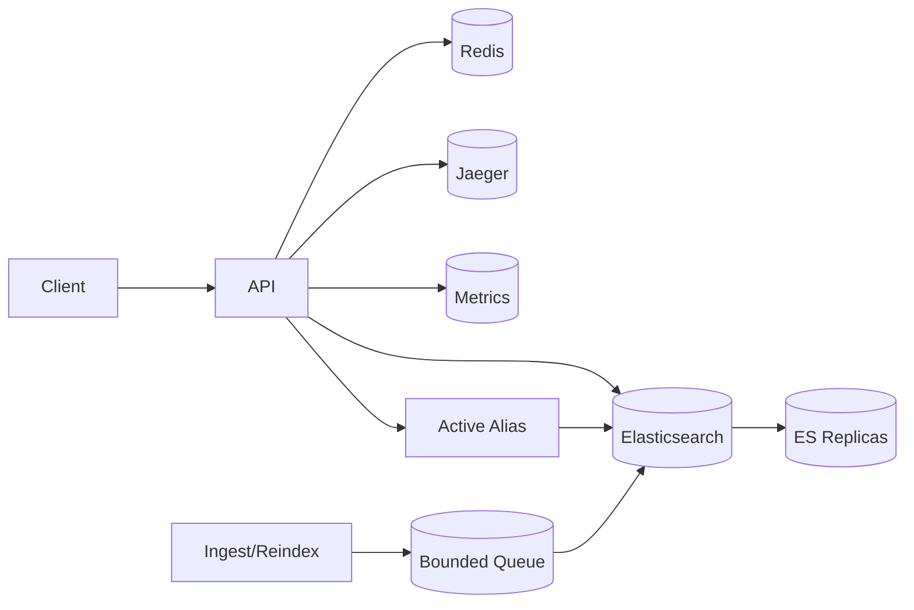
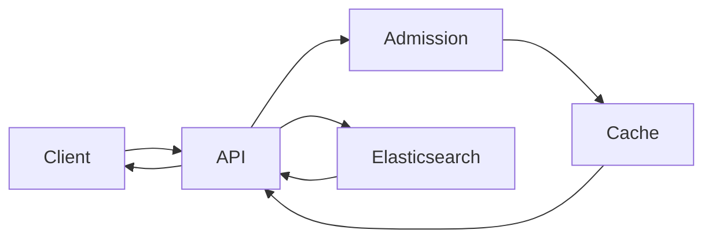
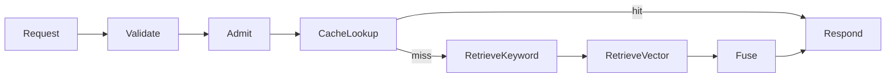
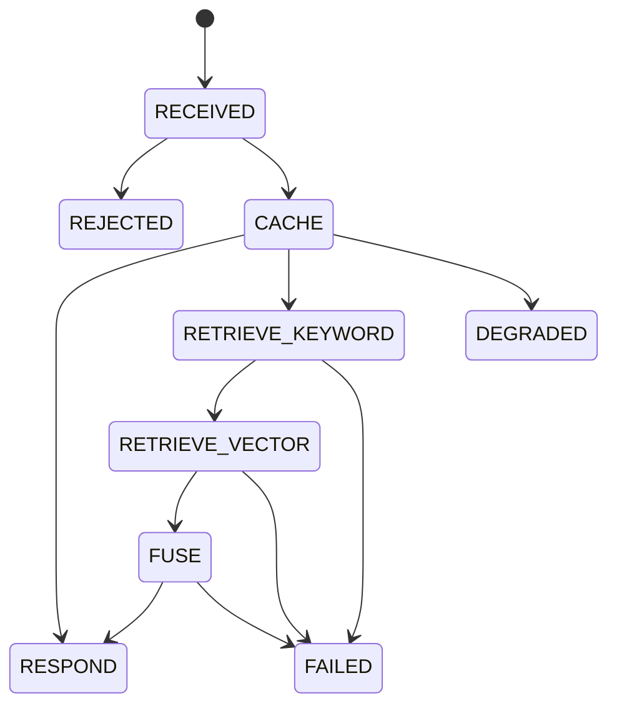
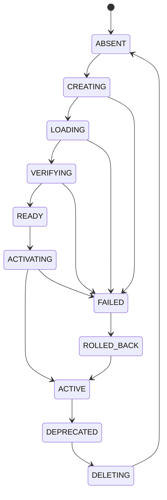

# Hybrid Search v2

## Problem
- Why: define the exact production target before implementation.
- Target: `1,000,000` magazine records.
- Target: `POST /search` as the only product endpoint.
- Target: Elasticsearch keyword + vector retrieval.
- Target: hybrid ranking.
- Target: Terraform-managed deployment.
- Target: `<= 100 GBP/month`.
- Target: daily freshness cutover at `23:00`.
- Target: recoverable, observable, version-safe.

## Gaps in v0
- Why: v2 must replace feasibility with bounded operation.
- No SLO/budget envelope.
- No cache/index version safety.
- No recovery path.
- No readiness/liveness contract.
- No deployment automation.
- No failure-aware lifecycle.
- No degraded mode contract.
- No observability contract.
- No audit trail.
- No ES scaling model.
- No data-structure contract.

## Gaps in v1
- Why: v2 must extend the bounded core with stronger telemetry and ops.
- Local-only deployment.
- No platform infrastructure.
- No Terraform.
- No Jaeger.
- No multi-instance admission correctness.
- No shared rate limiting.
- No daily index cutover.
- No alias-based active version workflow.
- No explicit index lifecycle state machine.
- No deployment cost model.
- No rollout plan.
- No recovery drills.
- No governance model.
- No quantified live data-structure analysis.

## FR
- Why: define the exact product promises and make them testable.
- FR-001: One product endpoint performs hybrid search.
- FR-002: Keyword search covers title, author, and content.
- FR-003: Vector search covers magazine content embeddings.
- FR-004: Hybrid ranking fuses both signals deterministically.
- FR-005: Search reads only from the active version.
- FR-006: Freshness cutover occurs once per day at `23:00`.
- FR-007: API responses expose bounded error and degradation states.
- FR-008: Deployment is reproducible via Terraform.

### Tests per FR
- Why: every functional promise must have a regression test.
- FR-001: valid request returns results; invalid request is rejected; only one product endpoint exists.
- FR-002: title/author/content matches return candidates.
- FR-003: vector match returns candidates; vector retrieval is bounded.
- FR-004: keyword-only and vector-only paths both contribute; score fusion is deterministic.
- FR-005: reads target only the active alias/version; inactive versions are not served.
- FR-006: cutover happens once; post-cutover reads see the new version.
- FR-007: 429 includes retryability signal; 504 maps to deadline exhaustion; degraded mode is explicit.
- FR-008: apply/destroy are repeatable; no manual infra steps are required.

## NFR
- Why: bound failure, cost, and behavior under live load.

### Invariants
- Why: these must always hold.
- Exactly one active index version serves reads.
- Request deadlines monotonically decrease.
- Candidate counts are bounded.
- Synchronous search has no queue.
- Error shape is deterministic.
- Cache keys include schema, model, and index version.

### Guarantees
- Why: these are the promised runtime outcomes.
- Overload returns `429` with retry guidance.
- Deadline exhaustion returns `504`.
- Cutover is atomic from the read path perspective.
- Rollback restores the previous active version.
- Resource teardown removes paid infrastructure.
- Degraded mode names the degraded dependency.
- Oversized requests return `413`.

### Latency Budgets
- Why: make live performance measurable and enforceable.

| Scenario | p50 | p95 | p99 | Hard limit |
| --- | ---: | ---: | ---: | ---: |
| Cache hit | `<= 20ms` | `<= 50ms` | `<= 100ms` | `<= 200ms` |
| Cache miss, warm ES | `<= 60ms` | `<= 150ms` | `<= 250ms` | `<= 500ms` |
| Cold cache, warm ES | `<= 80ms` | `<= 200ms` | `<= 350ms` | `<= 700ms` |
| Degraded cache | `<= 80ms` | `<= 250ms` | `<= 400ms` | `<= 800ms` |
| Degraded ES | `<= 150ms` | `<= 400ms` | `<= 700ms` | `<= 1200ms` |
| Overload rejection | `<= 10ms` | `<= 20ms` | `<= 50ms` | `<= 100ms` |

- Search deadline: `<= 1200ms`
- Redis timeout: `<= 100ms`
- Elasticsearch timeout: `<= 800ms`
- Request body limit: `<= 4 KiB`
- Query token limit: `<= 48`
- Max synchronous fanout: `3`
- Max candidate fusion set: `<= 200`
- Search queue wait: `0`

### Constraints
- Why: cap spend and deployment shape before implementation choices drift.

#### Economic
- Monthly spend: `<= 100 GBP`.
- Observability spend: `<= 20 GBP/month`.
- Storage growth must fit inside total spend for `1,000,000` docs.
- Cost model must cover compute, storage, egress, logs, traces, rollback.
- Per-query cost must be measured for cache hit, cache miss, degraded cache, degraded ES.
- Every instance type must be priced before acceptance.

#### Operational
- Terraform only.
- Jaeger included.
- Daily freshness cutover at `23:00`.
- Elasticsearch must scale reads via replicas.
- Platform resources must be explicitly sized.

### Decoded Reality
- Why: convert live-system physics into enforceable bounds.

#### Graph Theory
- Request-path nodes: `api`, `cache`, `elasticsearch`, `tracer`.
- Async nodes: `queue`, `worker`, `reindex`, `warmup`, `backfill`.
- Request-path edges: `api->cache`, `api->elasticsearch`, `api->tracer`.
- Synchronous hop count: `<= 2`.
- Critical-path dependencies: `<= 3`.
- Synchronous fanout from `api`: `<= 3`.
- Single-node failure domains on request path: `1`.
- Max request-path retries per dependency: `1`.
- Degrade/stop rule: if any request-path dependency misses its timeout budget, return `429`, `504`, or explicit degraded response.

#### Queue Theory
- Search queue length: `0`.
- Search wait time: `0`.
- Search overload response: `429` or `504`.
- Async jobs: ingest, reindex, warmup, backfill.
- Async queue max length: bounded per job class.
- Async queue max age: bounded per job class.
- Async retries: bounded.
- Async consumer semantics: idempotent.
- Search synchronous queue depth: `0`.
- Search sync retry policy: none.

#### Information Theory
- Required identifiers: `request_id`, `index_version`, `schema_version`, `model_version`, `degradation_reason` when degraded.
- Max label cardinality per metric: `<= 10`.
- Max trace attributes per span: `<= 16`.
- Max log line size: `<= 4 KiB`.
- Max raw query exposure: `0` by default.
- Max payload echo in errors: `0`.
- Retention: logs bounded, traces bounded, metrics bounded.
- Signal rule: every failure maps to one dependency class; every rollback maps to one cutover event.
- Useful signal ratio: requests without `request_id`: `0`; failures without dependency class: `0`; degraded responses without reason: `0`.

### Qualities to Optimise For
- Why: define what wins when requirements conflict.
- Scalability -> maximize: `1,000,000` docs; horizontally scalable read tier; read replicas absorb burst without sync queueing.
- Reproducibility -> maximize: Docker + Terraform; one-command deploy, seed, verify, teardown.
- Recovery speed -> maximize: rollback in one alias switch; explicit degraded state rather than silent failure.
- Tail latency stability -> maximize: bounded p95/p99; no unbounded queue growth on `/search`.
- Cost efficiency -> maximize: `<= 100 GBP/month`; cost per query recorded and bounded.
- Freshness -> maximize: daily cutover at `23:00`; active reads only from current version.
- Blast radius reduction -> maximize: isolate search, ingest, and observability concerns.
- Operational clarity -> maximize: deterministic errors, explicit degradation, bounded alert volume.
- Conflict rule: if latency and cost conflict, preserve bounded latency first, then reduce cost; if freshness and rollback safety conflict, preserve rollback safety first; if observability and cost conflict, preserve error observability first, reduce trace/log volume second; if throughput and correctness conflict, preserve correctness first.

### Scale
- Why: pin the corpus and deployment envelope the rest of the spec depends on.
- Corpus size: exactly `1,000,000` documents.
- Query volume: bounded by budget, replica count, and deadline.
- Shard count: intentionally low unless measured otherwise.
- Replica count: sized to satisfy read throughput and tail latency.
- Vector dimension: fixed and bounded by index mapping.
- Cache cardinality: bounded by `cache_max_entries` and active version count.
- Instance sizing must be recorded in the implementation plan: API, Elasticsearch primary, Elasticsearch replica, Redis, ingress / load balancing.

## Core Entities
- Why: make version, request, cache, and job state first-class.
- `IndexVersion`
- `ActiveAlias`
- `SearchRequest`
- `SearchResponse`
- `RequestContext`
- `CacheEntry`
- `IngestJob`
- `ReindexJob`
- `DeploymentUnit`

## Structure
- Why: pin request/response shape and system boundaries.

### APIs
- Why: define the only supported public surfaces.
- `POST /search`
- `GET /health/live`
- `GET /health/ready`
- `GET /metrics`
- `GET /rollout/status`

#### Search request
- body: `query`, `top_k`, `offset`, `category`
- headers: `x-request-id`, `x-client-id` only if trusted at the edge

#### Search response
- body: `request_id`, `degraded`, `degradation_reason`, `index_version`, `schema_version`, `model_version`, `results`

#### Status codes
- `200`: success
- `400`: invalid request
- `413`: body too large
- `429`: rate limited or overloaded
- `504`: deadline exceeded

#### Operational hooks
- `GET /rollout/status`: read-only rollout gate state for deployment automation.
- `scripts/index_rollout.py verify --index <concrete-index>`: verifies mappings, vector dimensions, and non-zero document count.
- `scripts/index_rollout.py cutover --index <concrete-index>`: atomically moves the active Elasticsearch alias during the `23:00` cutover window.
- `scripts/index_rollout.py rollback --index <previous-index>`: atomically restores the previous alias target.
- Runtime lifecycle service: `IndexLifecycleService` keeps active, previous, cutover, and rollback state inside the API process.

### Architecture
- Why: compress the live dependency graph into one view.

### Data Flows
- Why: show the synchronous request path end to end.

## Design To Satisfy FR
- Why: show how the contract is implemented, not just claimed.

### High Level
- Why: define the search pipeline at a glance.

### Low Level
- Why: prove the pipeline is bounded in time and space.

#### Lifecycle Model
- Why: show the request path as a finite sequence with capped work.
- Search lifecycle: receive, validate, admit, lookup cache, retrieve keyword, retrieve vector, fuse, respond.
- Complexity: keyword and vector retrieval costs are capped by candidate limits; fusion cost is capped by fusion candidate limit.
- Mitigation structures: bounded cache, bounded semaphore, bounded timeouts, bounded candidate lists.
- Search complexity: cache hit `O(1)` lookup + response shaping; cache miss `O(k log k)` over bounded candidates; `k <= max_fusion_candidates`.
- Search memory: live cache entries bounded by `cache_max_entries`; candidate maps bounded by retrieval caps; no unbounded per-request accumulation.

#### Data Structures
- Why: show which structures keep live cost bounded.
- `OrderedDict` cache: lookup `O(1)`, recency update `O(1)`, head eviction `O(1)`, bounded entries `cache_max_entries`.
- Candidate maps: `dict[int, float]`; dedup by magazine id.
- Ranked results: sort cost bounded by fusion cap; complexity `O(k log k)` where `k <= max_fusion_candidates`.
- Active version state: alias lookup `O(1)`.
- Queueing state: bounded queue length; bounded oldest-item age; async jobs only.

#### State Machine
- Why: make failure and degradation transitions explicit.

- Implemented in: `services.index_lifecycle.RequestState`.
- Telemetry: `hybrid_search_request_state_total{state}`.
- Terminal rule: each request reaches `respond`, `rejected`, or `failed`.

#### Index Lifecycle State Machine
- Why: make active alias, cutover, and rollback explicit.

- Implemented in: `services.index_lifecycle.IndexLifecycleService`.
- Cutover rule: target version must be `READY`; activation must occur at configured `cutover_hour:cutover_minute` unless forced for drills.
- Rollback rule: previous active version is restored in one lifecycle operation.
- Read rule: search response and cache namespace use `IndexLifecycleService.active_version`.
- Telemetry: `hybrid_search_index_lifecycle_transition_total{state}`, `hybrid_search_cutover_total{outcome}`, `hybrid_search_rollback_total{outcome}`.

## Deep Dives To Satisfy NFR
- Why: tie the design to production behavior and economics.

### Observability
- Why: keep enough signal to operate without unbounded telemetry cost.
- Jaeger traces: `100%` in staging, `<= 10%` in production unless incident mode.
- Metrics cardinality: `<= 10` labels per metric.
- Trace attributes: `<= 16` per span.
- Log line size: `<= 4 KiB`.
- Raw query exposure: `0` by default.
- Required identifiers: `request_id`, `index_version`, `schema_version`, `model_version`, `degradation_reason` when degraded.
- State metrics: request state, index lifecycle transitions, cutover, rollback, rollout gates.
- Rollout hook: `/rollout/status` exports bounded pass/fail gates and updates `hybrid_search_rollout_gate{gate}`.

### Math
- Why: state the load/capacity model behind the limits.
- Variables: arrivals `λ`, service rate `μ`, concurrency `c`, deadline `D`, hit ratio `h`, replicas `r`.
- Throughput: `T = min(μ * c, r * μ_es, budget_cap)`.
- Overload: if `λ > T`, return `429` or `504`.
- Cost per request: `C_req = C_hit * h + C_miss * (1 - h) + C_trace + C_log`.
- Tail latency: p95/p99 measured under cold cache, warm cache, degraded cache, degraded ES.
- Queue: search queue wait `= 0`; async queue wait `<= SLO_job`.

### Economic Value
- Why: require every component to earn its budget.
- Payoff thresholds: cache retained if ES reads drop by `>= 30%`; replica retained if p95 drops by `>= 20%` or throughput rises by `>= 20%`; Jaeger retained if MTTR drops by `>= 25%`; Terraform required if it removes manual infra steps.
- Cost thresholds: compute within monthly budget; storage within monthly budget; tracing `<= 20%` of monthly budget; logs bounded; egress bounded.
- Decision rule: keep a component only if measured benefit > measured cost.
- Cost model: fixed cost; per-query cost; per-doc storage cost; rollback cost.

### Implementation Mapping
- Why: keep the code wired to this contract.
- Request state machine: `src/services/index_lifecycle.py`, `src/controllers/search.py`, `src/services/search.py`.
- Index lifecycle, cutover, rollback: `src/services/index_lifecycle.py`.
- Rollout gates: `src/services/rollout.py`, `src/controllers/rollout.py`.
- Elasticsearch alias hooks: `scripts/index_rollout.py`.
- Active-version cache safety: `src/services/cache_base.py`.
- Telemetry: `src/helpers/metrics.py`.
- GCP Terraform: `deployment/cloud/gcp/`.
