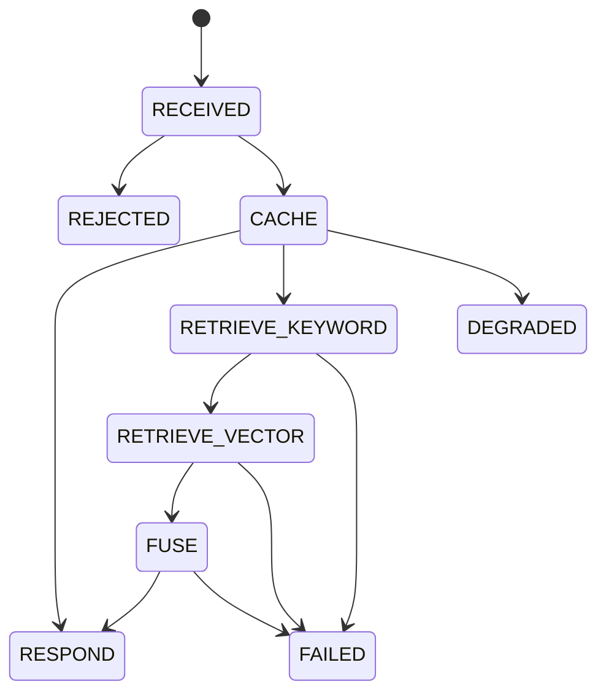
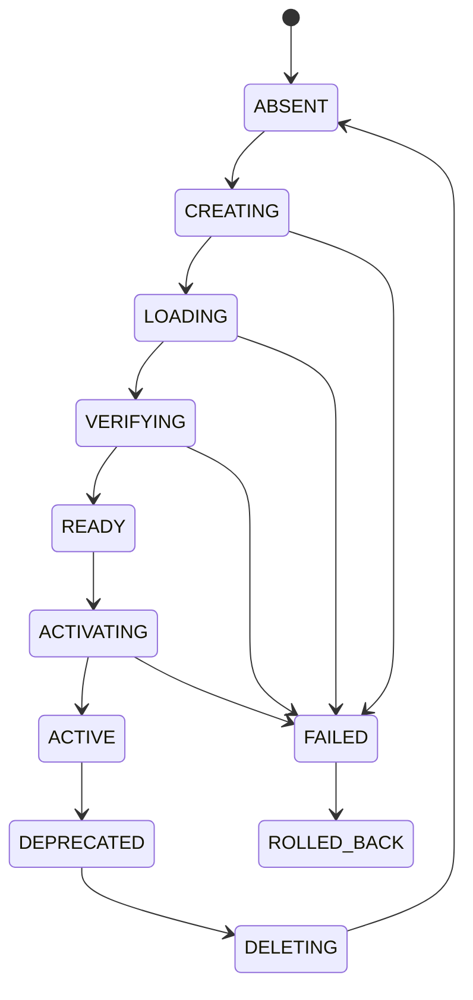

# Hybrid Search v2 Look Ahead

## Scope
- Why: define what v2 adds beyond the bounded v1 core.
- Corpus: exactly `1,000,000` docs.
- Deployment: Terraform-managed GCP.
- Freshness: daily cutover at `23:00`.
- Observability: stronger telemetry than v1.
- Control: stronger operational controls than v1.

## v1 Gains
- Why: preserve the bounded core instead of redoing it.
- request deadlines
- dependency timeouts
- bounded admission
- deterministic errors
- version-safe cache keys
- local reproducibility
- 1M-doc local verification

## v1 Gaps
- Why: these are the exact deltas v2 must close.
- cloud deployment
- Terraform
- Jaeger
- shared admission
- alias-based cutover
- explicit index lifecycle
- quantified cost model
- quantified rollout gates
- stronger telemetry

## v2 Additions
- Why: these are the new contracts v2 must satisfy.
- GCP deployment
- Elasticsearch replica scaling
- daily alias cutover
- explicit request and index state machines
- bounded queues only for async jobs
- quantified latency budgets
- quantified economic model
- rollout gates with metrics

## Modules
- Why: map v1 core into v2 extension points.
- `src/`: carry forward bounded request handling and version safety.
- `tests/`: extend with cutover, telemetry, and rollout tests.
- `deployment/`: add Terraform, GCP, scaling, and rollout machinery.
- `scripts/`: add seed, reindex, cutover, and cost probes.
- `.env` / `.env.example`: parameterize all bounds and instance sizing.

## State Machines
- Why: make request and index transitions explicit.

## Acceptance
- Why: v2 claims must be measurable.
- `1,000,000` docs searchable.
- p50/p95/p99 recorded per scenario.
- cost model recorded against instance pricing.
- rollback drill executed once.
- cutover executed once at `23:00`.
- telemetry volume bounded.
