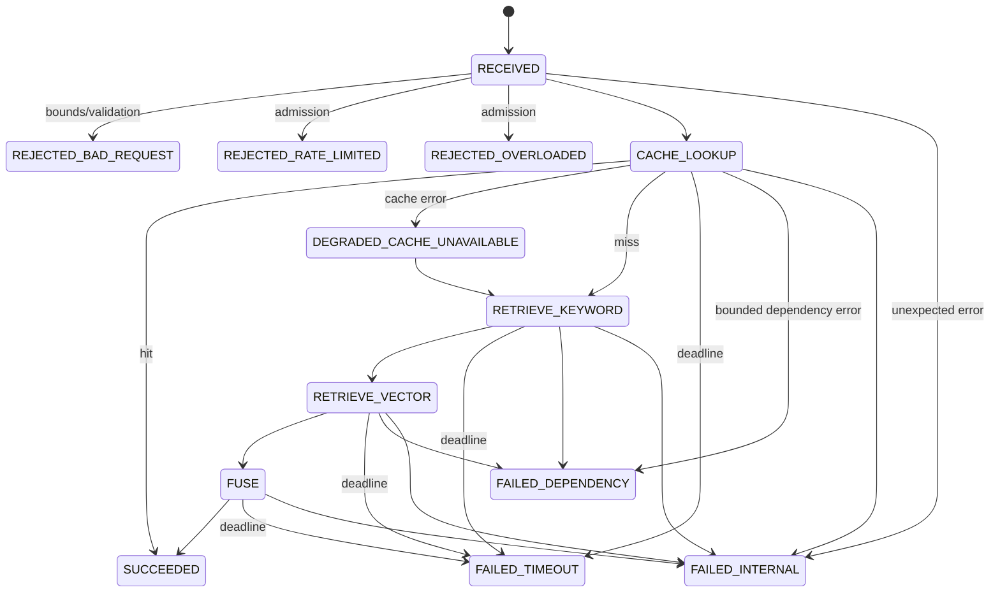
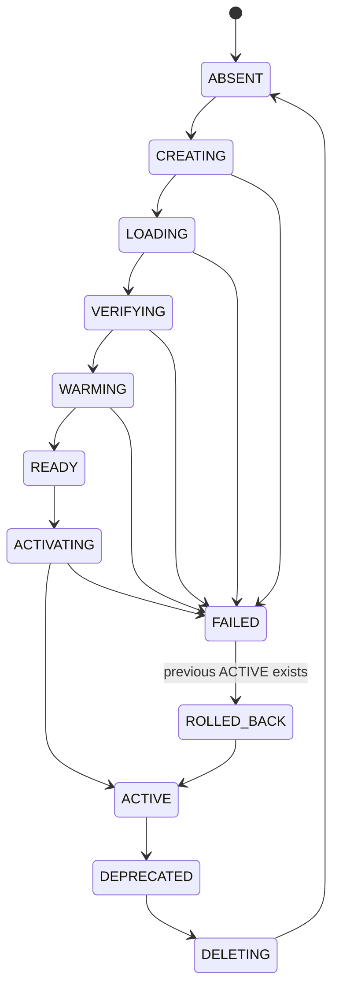

# Hybrid Search v2 Look Ahead

This document is scoped to `v2/` and is written against:

- `README.md` (root): version goals and non-negotiable rule.
- `v1/look ahead.md`: v0 gaps and v1 measured results.
- `v1/README.md`: v1 contract, bounds, and acceptance rule.

## Purpose

- Define `v2` deliverable scope, invariants, and failure-aware lifecycle.
- Specify what `v2` adds beyond `v1` and what remains out of scope (reserved for `v3`).
- Specify measurable acceptance criteria.

## v1 Gains

- Bounds exist and are enforced:
  - request deadlines, dependency timeouts, candidate caps, body size cap, query bounds, concurrency and rate limits.
- Real dependency path exists for local performance checks:
  - Compose stack with API + Redis + Elasticsearch.
  - Reproducible ingest and smoke performance harness.
- Failure-aware behavior exists:
  - explicit 429/504 paths, cache degradation signaling, deterministic error shape.
- Version safety improved:
  - cache keys include schema/index/model versions.
- Tests exist and run:
  - regression tests for bounds and basic safety behaviors.

## v1 Gaps

### Operational

- No cloud deployment.
- No infrastructure-as-code.
- No production networking boundaries (ingress, TLS, auth).
- No multi-instance correctness (rate limits/admission are per-process).
- No runbook-tested recovery procedures beyond local teardown.

### Economic

- No monthly cost model tied to real infra.
- No cost-per-query measurement under a real deployment.

### Mathematical / Relevance

- Hash embeddings are for systems testing only.
- No calibrated relevance, no golden set, no offline evaluation harness.

### Governance / Audit

- No auditable change management and no compliance posture (v3).

## v2 Definition

`v2` is production-grade in **operational mechanics** and **deployment discipline**, not business governance.

- Target platform: GCP.
- Deployment: Terraform.
- Budget: `<= 100 GBP / month`.
- Goal: simulate `v3` behavior closely enough to validate ops/econ design.
- Architecture:
  - Start as a single deployable unless measurements force a split.
  - Microservices only if required to satisfy measured v2 bounds, or to isolate dependency blast radius.
  - Corpus is exactly `1,000,000` docs for v2 claims (no more).
  - The v2 claim is on a cloud deployment, not localhost.
  - Freshness is end-of-day: a single daily cutover at `23:00` local time; daytime reads assume a stable index snapshot.

## v2 Non-Negotiables

- Every bound is:
  - configured via environment,
  - enforced in code and at the platform boundary,
  - measured and recorded.
- No claim without measurement (root rule).
- No v3 scope leakage (governance/compliance is deferred).

## Invariants

- Deadline monotonicity: remaining request budget never increases.
- Bounded work: candidate caps are hard limits; no unbounded fanout.
- Deterministic error shape: all failures map to stable `(status_code, error_code, message, details)` schema.
- Version safety: cache keys bind to `{schema_version, model_version, index_version}`; reads never mix active versions.
- Single active index: exactly one `ACTIVE` index version serves reads at a time.
- Cutover discipline: alias activation only at `23:00` local time.
- Bounded observability: trace/log/metric cardinality is bounded; raw queries are redacted by default.

## Guarantees

- Overload: bounded admission failure returns `429` with `Retry-After`; no silent queuing.
- Timeout: requests fail within the request deadline with `504`; dependency work is cancelled or bounded.
- Degradation: dependency failure surfaces as explicit degraded response or explicit error; never silent.
- Rollback: index activation is reversible to the last known `ACTIVE` version.
- Teardown: infrastructure destroy leaves no paid resources running.

## v2 State Machines

### Request State Machine

Invariants:

- Exactly one terminal state per request: `SUCCEEDED | FAILED_* | REJECTED_*`.
- Deadline is enforced end-to-end:
  - each dependency call is bounded by `min(request_deadline_remaining, dependency_timeout)`.
- Degradation is explicit in the response:
  - `degraded=true` implies `degradation_reason` is populated.
- 429 responses include `Retry-After`.

### Index Lifecycle State Machine

Invariants:

- Reads serve from exactly one `ACTIVE` index version.
- Cache namespace binds to `{schema_version, model_version, index_version}`.
- Activation is atomic (aliases or single “active version” record).
- Rollback is a first-class transition, not an ad hoc procedure.
- Verification must include:
  - mappings/dims checks,
  - doc count checks,
  - sampling queries,
  - latency budget checks.
  - Cutover policy:
    - index build and verification may run during the day,
    - alias activation occurs only at `23:00`,
    - rollback must be possible without data loss relative to the active snapshot.

## v2 Engineering Deliverables

### Deployment

- Terraform:
  - networking primitives, compute, storage, IAM boundaries (least privilege).
  - managed services selection justified against budget.
- Environments:
  - `dev` only for v2 (single bounded environment).
- One-command:
  - provision, deploy, seed, verify, teardown.

### Observability

- Metrics:
  - request state transitions, 429/504 ratios, dependency latency histograms, cache hit rate, ES query latency.
- Traces:
  - request spans with bounded cardinality attributes.
  - Jaeger included for trace storage/query (v2 requirement).
- Logs:
  - structured, redacted by default, correlated via request_id/trace_id.

### Safety / Controls

- Admission at platform boundary:
  - connection limits, read timeouts, max header size, request size limits.
- Dependency protection:
  - timeouts, bounded retries, circuit breaker policy for ES/Redis.

### Distributed Read Model

Assumptions:

- Daytime reads are served from a stable `ACTIVE` index snapshot.
- Index freshness is updated once per day via alias cutover at `23:00`.

Contract:

- Elasticsearch read throughput scales via replicas, not query fanout at the app tier.
- Shards are kept intentionally low for `1,000,000` docs; shard count increase requires measured justification.
- API tier is stateless and horizontally scalable behind an L7 load balancer.
- Admission/rate limiting must be correct in multi-instance operation (shared admission required if rate limits are not enforced at the edge).

### Decomposition

Allowed split candidates:

- `api-gateway` (validation, admission, deadline, response shaping).
- `search-service` (retrieval + fusion; isolated CPU/memory; dominates blast radius).
- `ingest-service` (bulk ingest, reindex orchestration, verification; async by design).

Split acceptance:

- A split must reduce a quantified risk (latency variance, dependency blast radius, cost spike).
- A split must preserve end-to-end deadline propagation and deterministic error shape.

### Queueing

Queue is **not** on the synchronous `/search` request path.

Queue is allowed/required for:

- ingest and reindex workflows,
- index warmup,
- backfills and verification jobs,
- asynchronous relevance evaluation runs.

Queue acceptance:

- bounded queue length,
- bounded retry policy with DLQ,
- measurable backlog and oldest-item age,
- idempotent consumers.

### Economics

- Budget model recorded:
  - predicted cost per 1M docs storage and per 1k queries.
- Hard ceilings:
  - cap instance sizes and service tiers to remain within `<= 100 GBP/month`.

## v2 Acceptance Criteria

- Provision and teardown:
  - Terraform apply/destroy produces no manual steps.
- Index lifecycle:
  - full `create -> load -> verify -> activate -> rollback` is executed at least once and logged.
- Performance:
  - corpus: `>= 1,000,000` docs.
  - record p50/p95/p99 for:
    - cold uncached query,
    - cached query,
    - degraded cache mode,
    - degraded ES mode (if defined).
- Stability:
  - controlled overload produces bounded 429s with `Retry-After` and no unbounded queue growth.
- Economic:
  - monthly estimate stays under `100 GBP` with explicit assumptions.

## Out Of Scope For v2

- Compliance frameworks (GDPR program, SLAs, formal audits).
- On-call sustainability program (rotations, paging policy, incident governance).
- Multi-tenant governance and policy enforcement.
- Formal relevance calibration program with business KPIs (can start eval harness in v2, but “calibrated” claim is v3).
